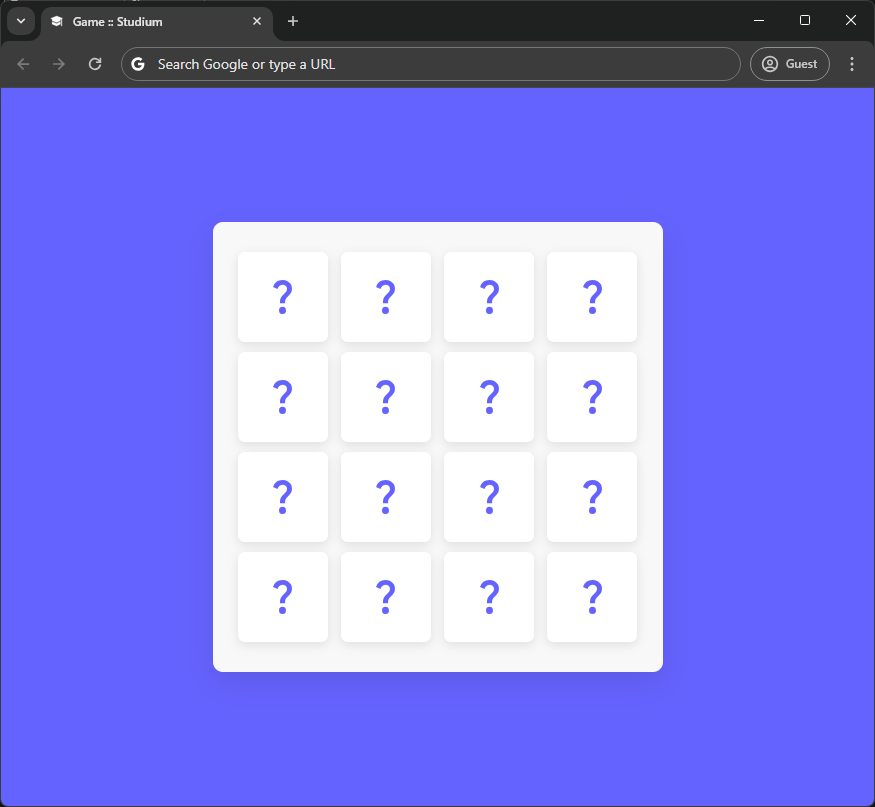
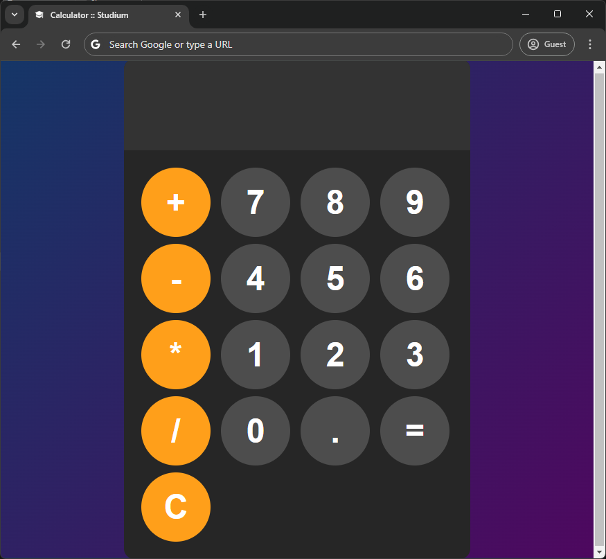

# Studium

Studium is a project - basically a bundle of projects meant to be used by students and teachers a like (if it really is even possible.)


## Acknowledgements

 - Code Borrowed from[ noHesi](https://github.com/TheRanxchives/nohesi.com)
 - Created using Tutorials from [YouTube](https://youtube.com)
 - Readme written with [readMe.so](https://readme.so)


## Authors

- [StudiumTools](https://www.github.com/StudiumTools)
- [Avun](https://www.github.com/avun-ai)


## Demo

This Demo doesn't contain any working Demo because of the nature of the project it can be run on a XAMPP server ([Click here](https://https://www.apachefriends.org/download.html) to download this free server.)


##  Screenshots
There are 7 Apps in total and a question mark? That you will have to wait until June 18th to discover. But, in this case can be very useful to any user who would like to. There are no code screenshots although.





### All Done in HTML, CSS & JS.

## Run Locally

Clone the project, and please use XAMPP as mentioned above, for the best experience possible.

```bash
  git clone https://github.com/StudiumTools/studium
```

Go to the project directory

```bash
  cd studium
```

Install XAMPP (via/ Chocolatey)

```bash
  chocolatey install xampp
```

Start XAMPP to start the project

```bash
 (unknown - preferred to do with GUI)
```


## Roadmap

- Browser support for the Big Three (Chrome, Firefox, (Edge & Safari) - Gecko)

- Written by Hand

- Written full in the main three front-end languages. HTML, CSS & Javascript.

- Student Graduation cap as FavIcon.


## Support

For support, [email us](mailto:trowesigames@gmail.com) or join our Discord Group (it may not be up right now.)

### Feedback

This also is the same for Feedback - wheter it is positive, or negative - you can give us constructive critism. No hate - please. Otherwise, we encourage you to [email us](mailto:trowesigames@gmail.com).

## FAQ

#### Is there anything you can add?

Yes, A lot! That is why you should look in our last section: Support, so that you can tell us what we are missing - and we can think and implement what-ever you would like!

#### Can I host this?

I don't know about places like WAMP, but I know you can host it on XAMPP - please refer to the section: "Run Locally" if you would like to do that - but I would prefer you refer to a [tutorial](https://www.youtube.com/watch?v=LzucEZh4_no).


## Used By

This project is used by the following companies:

- Studium

- noHesii

- Xiotim Corparation


## Installation

To install it please install XAMPP - but for better install - instructions check out "Run Locally"

```bash
    chocalatey install xampp
```
    
## Tech Stack

**Client:** HTML, CSS

**Server:** JavaScript (partially)


## Documentation

- This would be most of the Documentation that you could need but if you would like to refer to any more - you can at:

 - [CodingArtist](https://www.youtube.com/@CodingArtist)


## API Reference

This is a very surface level project - it should not need any outside API, maybe FontAwsome or heroIcon API(s) therefore requiring the internet but without the internet
it can still be used but you will lose some very nice quality-of-life improvements like icons.

